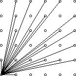

# 杰哥的妹子方阵

## 题目描述

校运会马上要开始了，杰哥的迷妹们正在为杰哥进行方阵排列训练

杰哥的妹子们都很文静，因此能够整齐的排列成 $n$ 行 $m$ 列的方阵

杰哥将于今晚八点检阅她的妹子方阵，对于给定的 $n$, $m$ 你需要告诉杰哥，他能看到的最多人数

以图中 6 * 6的方阵为例，能看到共21人



## 样例

### 样例输入
```
3 4
```

### 样例输出
```

```

## 数据范围