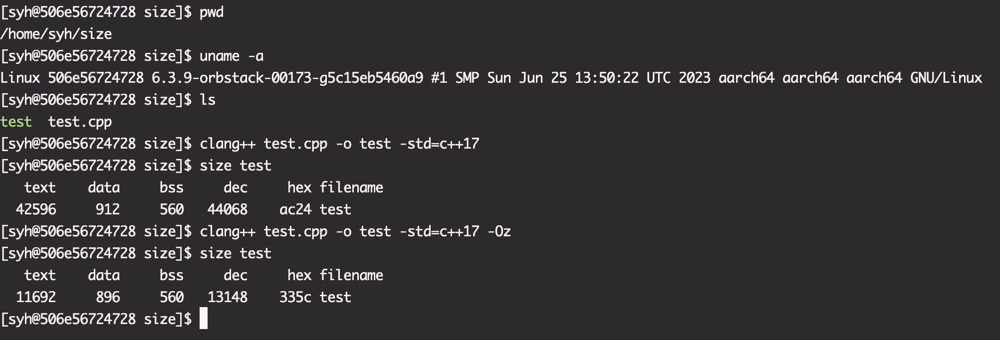
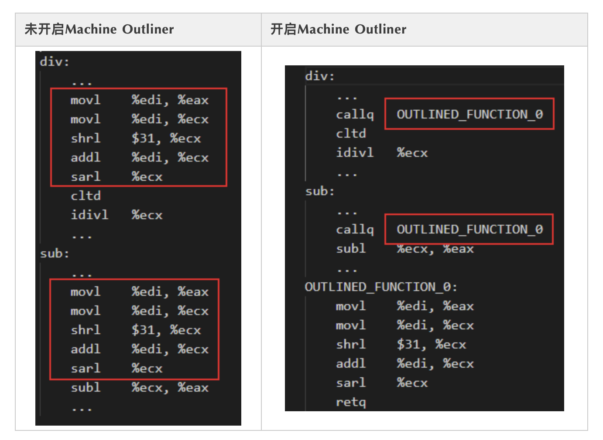

# 查看size & 有效的优化参数

> Code Generation Options
> 
> -O0, -O1, -O2, -O3, -Ofast, -Os, -Oz, -Og, -O, -O4¶
> Specify which optimization level to use:
> 
> -O0 Means “no optimization”: this level compiles the fastest and generates the most debuggable code.
> 
> -O1 Somewhere between -O0 and -O2.
> 
> -O2 Moderate level of optimization which enables most optimizations.
> 
> -O3 Like -O2, except that it enables optimizations that take longer to perform or that may generate larger code (in an attempt to make the program run faster).
> 
> -Ofast Enables all the optimizations from -O3 along with other aggressive optimizations that may violate strict compliance with language standards.
> 
> -Os Like -O2 with extra optimizations to reduce code size.
> 
> -Oz Like -Os (and thus -O2), but reduces code size further.
> 
> -Og Like -O1. In future versions, this option might disable different optimizations in order to improve debuggability.
> 
> -O Equivalent to -O1.
> 
> -O4 and higher
> 
> Currently equivalent to -O3

* 在-O.. 等优化参数中，-Oz对代码大小优化最为激进，Machine Outliner(将重复的汇编代码变成函数来调用，以此缩减代码大小)也被包含在内，其余时候要使用 -mllvm -enable-machine-outliner=always 来开启

Machine Outliner的效果

在源码中大量使用宏、模板，以及循环展开的场景下，开启Machine Outliner优化将会获得明显的code size收益；而对于程序本身code size很小、结构化设计良好，或者包含大量违反外提约束的情况，Machine Outliner对code size的优化效果不显著。